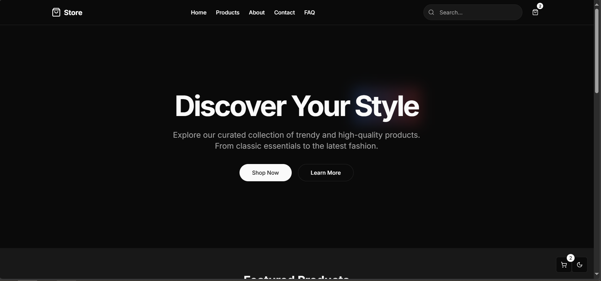

# 🛍️ Store - Your Fashion Destination

[](https://nextjs.org/)
[](https://reactjs.org/)
[](https://tailwindcss.com/)
[](https://opensource.org/licenses/MIT)
[](http://makeapullrequest.com)

A modern, feature-rich e-commerce platform built with cutting-edge technologies. Experience seamless shopping with our responsive design, intuitive navigation, and powerful features.



## ✨ Features

### Core Functionality
- 🎨 Responsive design optimized for mobile, tablet, and desktop devices
- 🌓 Dark mode support for comfortable viewing
- 🛍️ Intuitive product browsing with advanced filters and sorting
- 🔍 Detailed product pages with high-resolution images
- 🛒 Smart shopping cart with persistent storage
- 📱 PWA support for native-like mobile experience

### Technical Features
- ⚡ Lightning-fast page loads with Next.js
- 🎯 SEO optimized for better visibility
- 🔒 Secure payment processing
- 📊 Analytics integration ready
- 🌐 Internationalization support

## 🚀 Getting Started

### Prerequisites
- Node.js 16.x or later
- npm or yarn package manager

### Installation

1. Clone the repository:
   ```bash
   git clone https://github.com/yourusername/store.git
   ```

2. Navigate to the project directory:
   ```bash
   cd store
   ```

3. Install dependencies:
   ```bash
   npm install
   # or
   yarn install
   ```

4. Set up environment variables:
   ```bash
   cp .env.example .env.local
   ```

5. Start the development server:
   ```bash
   npm run dev
   # or
   yarn dev
   ```

6. Open [http://localhost:3000](http://localhost:3000) in your browser

## 🛠️ Tech Stack

- **Framework:** [Next.js](https://nextjs.org/) - React framework for production
- **Styling:** [Tailwind CSS](https://tailwindcss.com/) - Utility-first CSS framework
- **UI Components:** [shadcn/ui](https://ui.shadcn.com/) - Beautiful and accessible components
- **Icons:** [Lucide Icons](https://lucide.dev/) - Beautiful & consistent icons
- **State Management:** React Context API
- **Development Tools:**
  - TypeScript
  - ESLint
  - Prettier
  - Husky

## 📦 Project Structure

```
store/
├── components/        # Reusable UI components
├── pages/            # Next.js pages
├── public/           # Static assets
├── styles/          # Global styles
├── lib/             # Utility functions
├── context/         # React Context providers
└── types/           # TypeScript type definitions
```

## 🚀 Deployment

The project is optimized for deployment on [Vercel](https://vercel.com/). Follow these steps:

1. Create a Vercel account
2. Install Vercel CLI: `npm i -g vercel`
3. Run: `vercel deploy`

For other platforms, check out the [deployment documentation](https://nextjs.org/docs/deployment).

## 🤝 Contributing

We love your input! We want to make contributing as easy and transparent as possible. Please:

1. Fork the repo
2. Create your feature branch (`git checkout -b feature/amazing-feature`)
3. Commit your changes (`git commit -m 'Add some amazing feature'`)
4. Push to the branch (`git push origin feature/amazing-feature`)
5. Open a Pull Request

For major changes, please open an issue first to discuss what you would like to change.

## 📝 License

This project is licensed under the MIT License - see the [LICENSE](LICENSE) file for details.

## 🙏 Acknowledgments

- Thanks to all contributors who have helped shape Store
- [Next.js team](https://nextjs.org/) for the amazing framework
- [Tailwind CSS](https://tailwindcss.com/) for the utility-first CSS framework
- [shadcn/ui](https://ui.shadcn.com/) for beautiful UI components

## 📧 Contact

For support or queries, please open an issue or contact the maintainer:

- NatroyX - [@XNatroy](https://twitter.com/XNatroy)
- NatroyX - [@XNatroy](https://dev.to/natroyx)
- Project Link: [https://github.com/NatroyX/store](https://github.com/NatroyX/store)

---

<p align="center">Made with ❤️ for the community</p>